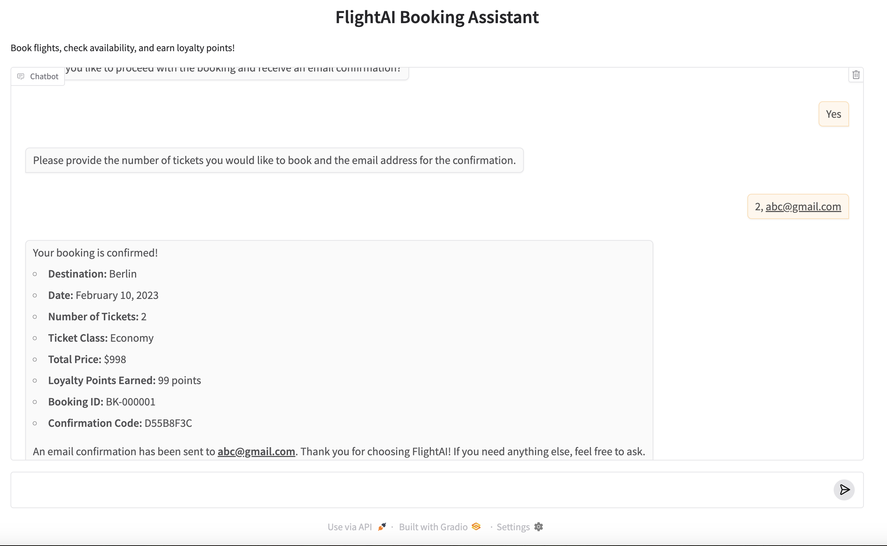
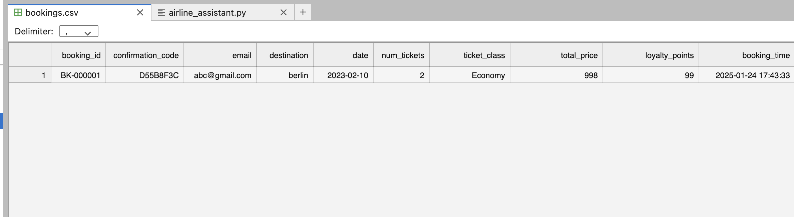

# Airline AI Assistant

An AI-powered airline booking system demonstrating OpenAI's Function Calling capabilities with a natural language interface. Based on [OpenAI Function Calling Guide](https://platform.openai.com/docs/guides/function-calling).

## Project Purpose

This project showcases:
- Integration of LLM with custom functions/tools
- Natural language processing for airline bookings
- Real-world implementation of function calling
- Structured data handling through AI interactions

## Features

- Natural language ticket booking and inquiries
- Real-time price checking
- Multiple ticket classes (Economy, Business, First)
- Loyalty points system
- Seat availability tracking
- Booking history
- Date-based reservations
<p align="left">
  
</p>

## Prerequisites

- Python 3.11+
- OpenAI API key
- Required Python packages (see requirements.txt)

## Installation

1. Clone the repository:
```bash
git clone https://github.com/yourusername/airline-ai-assistant.git
cd airline-ai-assistant
```

2. Install dependencies:
```bash
pip install -r requirements.txt
```

3. Create .env file:
```bash
OPENAI_API_KEY=your_api_key_here
```

## Usage

Run the application:
```bash
python airline_booking.py
```

The chat interface will open in your browser at `http://localhost:7860`.

### Example Commands
- "What's the price for a ticket to London?"
- "Book 2 economy tickets to Paris for March 15"
- "Check availability for business class to Tokyo next week"

## LLM Function Calling

The assistant uses OpenAI's function calling capability to handle specific tasks:

### Available Tools

1. `check_flight`
   ```json
   {
     "name": "check_flight",
     "parameters": {
       "destination": "string",
       "date": "string (YYYY-MM-DD)",
       "ticket_class": "string"
     }
   }
   ```

2. `book_flight`
   ```json
   {
     "name": "book_flight",
     "parameters": {
       "destination": "string",
       "date": "string (YYYY-MM-DD)",
       "num_tickets": "integer",
       "ticket_class": "string",
       "email": "string"
     }
   }
   ```

### Tool Handling Flow
1. User inputs natural language request
2. LLM determines required tool
3. Tool call is processed by respective handler
4. Response is formatted and returned to user


## Project Structure

```
airline-ai-assistant/
├── airline_booking.py
├── requirements.txt
├── .env
├── bookings.csv
└── README.md
```

## Data Storage

<p align="left">
  
</p>

Bookings are stored in `bookings.csv` with the following fields:
- booking_id
- confirmation_code
- email
- destination
- date
- num_tickets
- ticket_class
- total_price
- loyalty_points
- booking_time

## Dependencies

- openai
- gradio
- pandas
- python-dotenv
- datetime

## Error Handling

The system handles:
- Invalid destinations
- Insufficient seat availability
- Invalid email formats
- Invalid ticket classes
- Date validation
- API failures

## Contributing

1. Fork the repository
2. Create feature branch
3. Submit pull request

## License

MIT License - See LICENSE file for details
